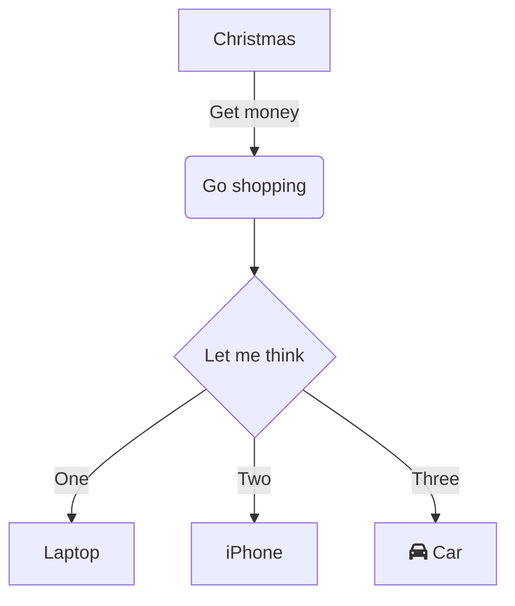

# DashBoard_NBA
## Introduction
Ce projet s'effectue dans le cadre de l'unité E3FI-PR2 créé par Daniel Courivau. L'objectif de ce projet est d'utiliser des outils de base pour créer un DashBoard interactif sur un jeu de donnée de notre choix. Nous avons choisis de baser notre projet sur les statistiques des joueurs NBA. Le DashBoard contient un histogramme sur le nombre total de points marqués par les joueurs NBA et une representation géolocalisée des 20 meilleurs scoreurs de la ligue (point par match).

Les données des joueurs ont été scrapper sur le site  [basketball reference](https://www.basketball-reference.com) dans l'onglet 'Leader' -> '2022-2023 NBA' -> 'Points'.
Pour chaque joueur, 30 données statistiques différentes sont disponibles sur le site. Dans le processus de scrapping, nous récupérons ces 30 colonnes mais seul le nom, les points (PTS) et le nombre de matchs (G) joués sont utilisés dans le DashBoard.

## User Guide
Pour utiliser le DashBoard sur votre machine, vous devez tout d'abord vous assurer d'avoir correctement installer Git. Pour installer les packages nécessaire à la bonne excecution du code, entrer la commande suivante dans un terminal:
``` 
$ python -m pip install -r requirements.txt
```

Pour cloner le depôt sur votre machine, entre la commande suivante dans un terminal:
```
$ cd Votre_Repertoire_De_Travail
$ git clone adresse_publique_de_votre_projet
```

Pour lancer le scrapping des données et créer le DashBoard, excecutez cette commande dans le terminal.
```
$ python main.py
```
Vous pouvez consultez le DashBoard [ici](http://127.0.0.1:8050/) 
## Rapport d'analyse

  
## Developper Guide
